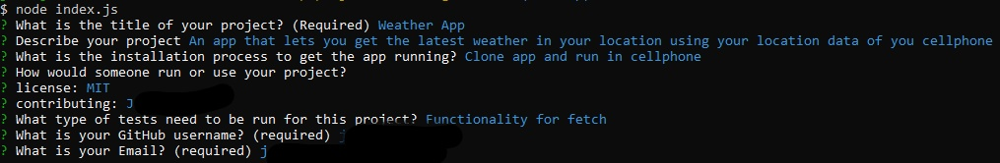

# Professional README Generator

## Description
This is a challenge that is for the Coding Bootcamp week 9. It is a program that is run through Node.js that helps you quckily create a README to include to any project you may be working on.

## Screenshot of the app being used

## Demonstration Video

[Professional-README-generator](https://drive.google.com/file/d/1H_KFdguQPPqSvUCfa_G1GQRPOBtikaLg/view)